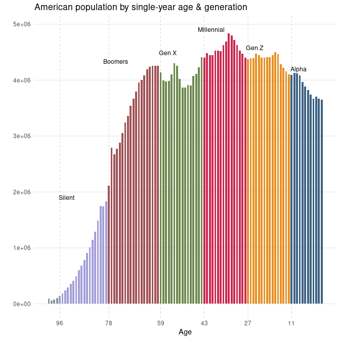

# American Generations

> A quick look at the racial/ethnic composition and age distribution of
> American generations. Per Pew Research definitions & US Census data.

``` r
library(dplyr)

gen <- c('Alpha', 
         'Gen Z', 
         'Millennial', 
         'Gen X', 
         'Boomers', 
         'Silent', 
         'Greatest')

start <- c(2013, 1997, 1981, 1965, 1946, 1928, 1901)
end <- c(2028, 2012, 1996, 1980, 1964, 1945, 1927)

gen_desc <- data.frame(rank = 7:1,
                       gen = gen,
                       start = start,
                       end = end)

gen_desc |> knitr::kable()
```

| rank | gen        | start |  end |
|-----:|:-----------|------:|-----:|
|    7 | Alpha      |  2013 | 2028 |
|    6 | Gen Z      |  1997 | 2012 |
|    5 | Millennial |  1981 | 1996 |
|    4 | Gen X      |  1965 | 1980 |
|    3 | Boomers    |  1946 | 1964 |
|    2 | Silent     |  1928 | 1945 |
|    1 | Greatest   |  1901 | 1927 |

## Monthly Postcensal Resident Population

*Monthly Postcensal Resident Population*, 7/1/2024 to 12/1/2024. Made
available by the US Census as CSV file
[here](https://www2.census.gov/programs-surveys/popest/datasets/2020-2023/national/asrh/nc-est2023-alldata-p-file10.csv).

> **U.S. Census Bureau.** (2023). *Monthly Population Estimates by Age,
> Sex, Race, and Hispanic Origin for the United States: April 1, 2020,
> to July 1, 2023 (with short-term projections to December 2024).*
> National population estimates. U.S. Department of Commerce. Retrieved
> from <https://www.census.gov>

``` r
dlink <- 'https://www2.census.gov/programs-surveys/popest/datasets/2020-2023/national/asrh/nc-est2023-alldata-p-file10.csv'

pops <- read.csv (
  url(dlink)) |>
  filter(MONTH == '10' & YEAR == '2024') |> 
  tidyr::gather(key = 'race', 
                value = 'pop', 
                -UNIVERSE:-AGE)
```

A more detailed description of the population estimates can be found
[here](https://www.census.gov/data/tables/time-series/demo/popest/2020s-national-detail.html).
Note: Race categories reflect non-Hispanic populations.

``` r
race <- c('NHWA', 'NHBA', 'NHIA', 
          'NHAA', 'NHNA', 'NHTOM', 'H')

race1 <- c('White Alone',
           'Black Alone',
           'American Indian Alone',
           'Asian Alone',
           'Native Hawaiian Alone',
           'Two or More Races',
           'Hispanic')

labels <- data.frame(race = race, 
                     race1 = race1)

search <- paste(paste0('^',race, '_'), collapse =  '|')
```

The following table details **a random sample of the data set** – with
Pew Research defined generations & estimated year-of-birth.

``` r
gen_pops <- pops |>
  filter(grepl(search, race)) |>
  mutate(race = gsub('_.*$', '', race)) |>
  group_by(AGE, race) |>
  summarise(pop = sum(pop))|>
  left_join(labels) |>
  filter(AGE != '999') |>
  mutate(yob = 2024 - AGE)

# Join gen_pops with gen_desc based on yob within start and end range
data.table::setDT(gen_pops)[gen_desc, 
                            on = .(yob >= start, yob <= end), 
                            gen := i.gen]

gen_pops1 <- gen_pops |> left_join(gen_desc)
```

``` r
gen_pops1 |> 
  select(race1, yob, AGE, gen, pop) |>
  sample_n(7)  |>
  knitr::kable()
```

| race1                 |  yob | AGE | gen        |     pop |
|:----------------------|-----:|----:|:-----------|--------:|
| American Indian Alone | 1945 |  79 | Silent     |   11158 |
| Asian Alone           | 1953 |  71 | Boomers    |  171729 |
| Asian Alone           | 2024 |   0 | Alpha      |  193309 |
| White Alone           | 1975 |  49 | Gen X      | 2212520 |
| Native Hawaiian Alone | 1983 |  41 | Millennial |   10592 |
| White Alone           | 1987 |  37 | Millennial | 2475205 |
| Hispanic              | 1999 |  25 | Gen Z      | 1033154 |

## Composition of American generations

### Population by generation

``` r
library(ggplot2)
gen_pops1 |>
  group_by(gen, rank) |>
  summarize(pop = sum(pop)) |>
  mutate(lab = round(pop/1000000, 1)) |>
  ggplot(aes(x = reorder(gen, rank), 
             y = pop, 
             fill = gen)) +
  geom_col(show.legend = FALSE, 
           alpha = 0.75)  +
  geom_text(aes(label = lab), 
            size = 3.5)+
  theme(axis.text.x=element_blank(),
        axis.ticks.x=element_blank())+
  xlab('') + ylab('') +
  coord_flip()+
  ggthemes::scale_fill_stata() +
  theme_minimal() +
  labs(title = 'Population by American Generation',
       caption = 'SOURCE: US Census, Monthly Postcensal Resident Population, October 2024.')
```


### Population by single year of age & generation

``` r
gg <- gen_pops1 |> 
  group_by(yob, AGE, gen) |>
  summarize(tot = sum(pop)) |>
  group_by(gen) |>
  mutate(tot = max(tot)) |> #For labels below.
  filter(yob %in% c('1919', '1928', '1946', '1965', 
                    '1981', '1997', '2013'))
```

The figure below illustrates the US population by single year of age,
ranging from the population aged less than a year to the population over
100 (as of October 2024). Generation membership per single year of age
is specified by color.

``` r
gen_pops |>
  ggplot(aes(x = AGE, 
             y = pop, 
             fill = gen)) +
  geom_vline(xintercept = gg$AGE,
             linetype =2, 
             color = 'gray', 
             linewidth = .25)+
  geom_col(show.legend = FALSE, 
           alpha = 0.85,
           width = .7)   +
  annotate(geom="text", 
           x = gg$AGE - 2.5, 
           y = gg$tot + 70000, 
           label = gg$gen,
           size = 3.25) +
  xlab('Age')+ 
  ylab('') +
  theme_minimal() +
  theme(legend.position="bottom",
        legend.title = element_blank(),
        panel.grid.major.x=element_blank(),
        panel.grid.minor.x=element_blank(),
        panel.grid.minor.y=element_blank()) +
  ggthemes::scale_fill_stata()+
  scale_x_reverse(breaks = rev(gg$AGE)) +
  
  labs(title = 'American population by single-year age & generation')
```



### Population by single year of age, race & generation

``` r
gen_pal <- c('#b0bcc1','#ead8c3', '#437193', 
             '#c66767', '#55752f', '#dae2ba', 
             '#7b9bb3')
```

``` r
gen_pops |>
  ggplot(aes(x = AGE, 
             y = pop, 
             fill = race1)) +
  geom_area(stat = "identity",
            color = 'white',
            alpha = 0.85) +
  scale_fill_manual(values = gen_pal) +
  geom_vline(xintercept = gg$AGE,
             linetype = 2, 
             color = 'gray', 
             linewidth = .25)+
  annotate(geom="text", 
           x = gg$AGE - 4.5, 
           y = gg$tot + 70000, 
           label = gg$gen,
           size = 3.25) +
  xlab('')+ ylab('') +
  theme_minimal() +
  theme(legend.position="bottom",
        legend.title = element_blank(),
        panel.grid.major.x=element_blank(),
        panel.grid.minor.x=element_blank(),
        panel.grid.minor.y=element_blank()) +
  
  scale_x_reverse(breaks = rev(gg$AGE) )+
  labs(title ='American population by age, race & generation')
```


### A cross-section

``` r
white_label <- gen_pops |> 
  group_by(gen, AGE) |>
  mutate(per = pop/sum(pop))|>
  filter(race1 == 'White Alone') |>
  group_by(gen) |>
  mutate(per = max(per)) |> #For labels below.
  arrange(yob) |>
  filter(yob %in% c('1919', '1928', '1946', '1965', 
                    '1981', '1997', '2013'))
```

The final figure provides a **proportional breakdown of race and
ethnicity in the United States**, organized by single year of age.

> The chart illustrates a clear and ongoing demographic shift in the
> racial and ethnic composition of the American population across
> generations. Older cohorts, such as the Silent Generation and Baby
> Boomers, are overwhelmingly composed of individuals categorized as
> “White Alone,” with minimal representation from other racial and
> ethnic groups. As we move to younger generations, starting with
> Generation X, there is a noticeable increase in diversity.

> Millennials, Generation Z, and Generation Alpha demonstrate
> significant changes, with the proportion of “White Alone” individuals
> decreasing steadily. At the same time, the share of Hispanic, Asian,
> and mixed-race populations (“Two or More Races”) grows considerably.
> This pattern underscores a broader trend toward greater racial and
> ethnic diversity in the younger cohorts. By the time we reach
> Generation Alpha, the demographic composition becomes the most
> diverse, reflecting the cumulative impact of immigration,
> intermarriage, and evolving cultural identities.

> This progression highlights a generational shift in the United States,
> where younger populations represent a more multicultural and
> pluralistic society, contrasting sharply with the more homogenous
> makeup of older generations. The chart encapsulates how societal and
> demographic changes are reshaping the fabric of the nation over time.

``` r
gen_pops |>
  group_by(gen, AGE) |>
  mutate(per = pop/sum(pop)) |>
  ggplot(aes(x = (AGE), 
             y = per, 
             fill = race1)) +
  geom_area(stat = "identity",
            color = 'white',
            alpha = 0.85) +
  geom_hline(yintercept = .5, 
             linetype = 4,
             color = 'white') +
  scale_fill_manual(values = gen_pal) +
  geom_vline(xintercept = gg$AGE,
             linetype = 2, 
             color = 'gray', 
             linewidth = .25)+
  annotate(geom="text", 
           x = gg$AGE-4.5, 
           y = white_label$per - .05, 
           label = gg$gen,
           size = 3.25) +
  xlab('')+ ylab('') +
  theme_minimal() +
  theme(legend.position="bottom",
        legend.title = element_blank(),
        panel.grid.major.x=element_blank(),
        panel.grid.minor.x=element_blank()) +
  
  scale_x_reverse(breaks = rev(gg$AGE)) +
  labs(title = 'American population by age, race & generation')
```


